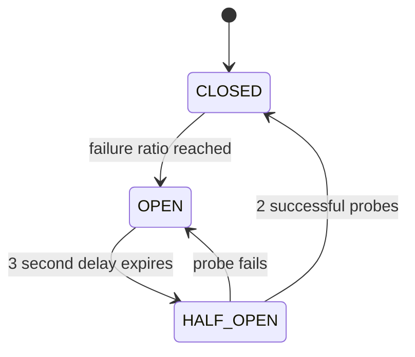
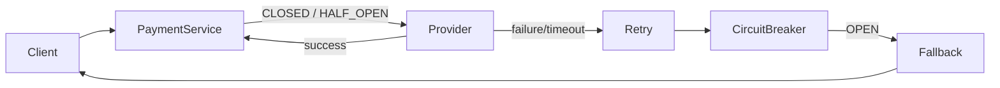

# 05 - Circuit Breaker with Quarkus

Educational two-service Quarkus example showing `@Timeout`, bounded `@Retry`, `@CircuitBreaker`, and `@Fallback` around an HTTP payment dependency.

## Services

- `payment-service` on port `8080`
- `fake-payment-provider` on port `8081`

The provider supports runtime modes `NORMAL`, `ALWAYS_FAIL`, `SLOW`, and `FAIL_PERCENTAGE`.

## Circuit Breaker states



- **CLOSED**: calls are allowed and failures are measured.
- **OPEN**: calls fail fast without invoking the provider.
- **HALF_OPEN**: limited probe calls test whether the provider recovered.

## Fault tolerance

`PaymentGateway.pay()` uses a 750 ms timeout, one retry with a 100 ms delay, a circuit breaker window of 4 attempts with a 50% failure ratio, a 3 second open delay, two successful recovery probes, and a fallback returning `UNAVAILABLE`.

Retries are intentionally bounded. Excessive retries can amplify an outage: a failing dependency receives even more requests, consumes threads/connections/CPU, becomes less likely to recover, and can trigger a retry storm. The circuit breaker stops repeatedly hammering that dependency.



## Run

```bash
mvn -pl fake-payment-provider quarkus:dev
```

In another terminal:

```bash
mvn -pl payment-service quarkus:dev
```

## Healthy provider

```bash
curl -X POST http://localhost:8081/admin/reset
curl -X POST http://localhost:8080/admin/reset
curl -X PUT http://localhost:8081/admin/mode/NORMAL
curl -X POST http://localhost:8080/payments \
  -H 'Content-Type: application/json' \
  -d '{"orderId":"order-1","amount":100,"currency":"EUR"}'
curl http://localhost:8080/admin/stats
```

The circuit state should be `CLOSED`.

## Open the circuit

```bash
curl -X POST http://localhost:8081/admin/reset
curl -X POST http://localhost:8080/admin/reset
curl -X PUT http://localhost:8081/admin/mode/ALWAYS_FAIL

curl -X POST http://localhost:8080/payments \
  -H 'Content-Type: application/json' \
  -d '{"orderId":"failure-1","amount":100,"currency":"EUR"}'

curl -X POST http://localhost:8080/payments \
  -H 'Content-Type: application/json' \
  -d '{"orderId":"failure-2","amount":100,"currency":"EUR"}'

curl http://localhost:8080/admin/stats
curl http://localhost:8081/admin/stats
```

At this point the payment service reports `OPEN`. Record `providerCalls` / `receivedCalls`, then call again:

```bash
curl -X POST http://localhost:8080/payments \
  -H 'Content-Type: application/json' \
  -d '{"orderId":"fail-fast","amount":100,"currency":"EUR"}'

curl http://localhost:8080/admin/stats
curl http://localhost:8081/admin/stats
```

The fallback counter increases, but the provider call counters do not: the open circuit rejected the invocation locally.

## Recover: OPEN -> HALF_OPEN -> CLOSED

```bash
curl -X PUT http://localhost:8081/admin/mode/NORMAL
sleep 4

curl -X POST http://localhost:8080/payments \
  -H 'Content-Type: application/json' \
  -d '{"orderId":"probe-1","amount":100,"currency":"EUR"}'
curl http://localhost:8080/admin/stats

curl -X POST http://localhost:8080/payments \
  -H 'Content-Type: application/json' \
  -d '{"orderId":"probe-2","amount":100,"currency":"EUR"}'
curl http://localhost:8080/admin/stats
```

The first successful probe moves the circuit through `HALF_OPEN`; after the required successful probes it returns to `CLOSED`.

## Other provider modes

```bash
curl -X PUT http://localhost:8081/admin/mode/SLOW
curl -X PUT http://localhost:8081/admin/slow-delay/2000

curl -X PUT http://localhost:8081/admin/mode/FAIL_PERCENTAGE
curl -X PUT http://localhost:8081/admin/failure-percentage/50
```

## Stats

```bash
curl http://localhost:8080/admin/stats
```

Example:

```json
{
  "providerCalls": 4,
  "successfulCalls": 0,
  "failedCalls": 4,
  "fallbackCalls": 3,
  "circuitState": "OPEN"
}
```

Because `providerCalls` increments inside the protected method, it does not increase while SmallRye rejects calls because the circuit is open.

## Tests

```bash
mvn test
```

Tests cover healthy calls, repeated failures, opening the circuit, fail-fast calls that do not contact the provider, fallback behavior, and provider recovery back to `CLOSED`.
